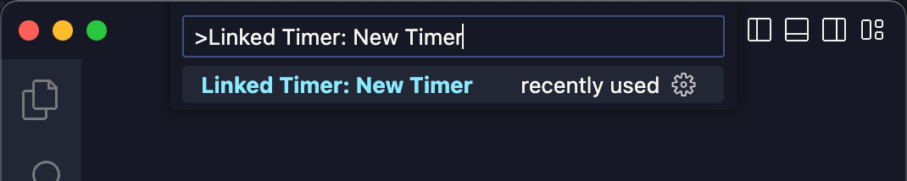
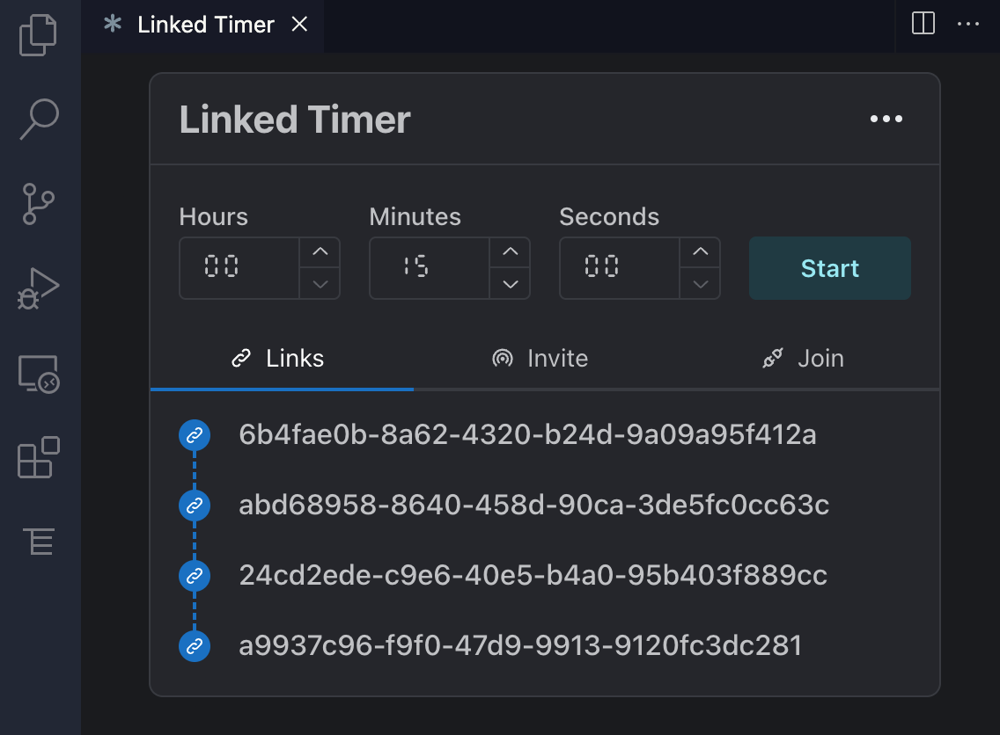
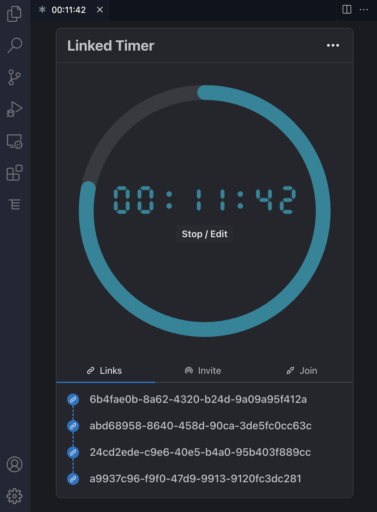

# Linked Timer

Real-time collaborative countdown timer to use with your team.

## Features

- Available as a web app at [LinkedTimer.com](https://linkedtimer.com), which it can be accessed from any device with a web browser. No installation required!
- Downloadable as an extension for VS Code at [VS Marketplace](https://marketplace.visualstudio.com/items?itemName=felladrin.linked-timer) and [Open VSX Registry](https://open-vsx.org/extension/felladrin/linked-timer).
- Host and join countdown sessions with your team members, the remaining time is synchronized and updated for everyone in real-time.

## Usage in VS Code

Type `>Linked Timer: New Timer` in the Command Palette to open a new Timer Tab, from there you can host or join a timer from someone else.

|                                              |                                              |                                              |
| -------------------------------------------- | -------------------------------------------- | -------------------------------------------- |
|  |  |  |
